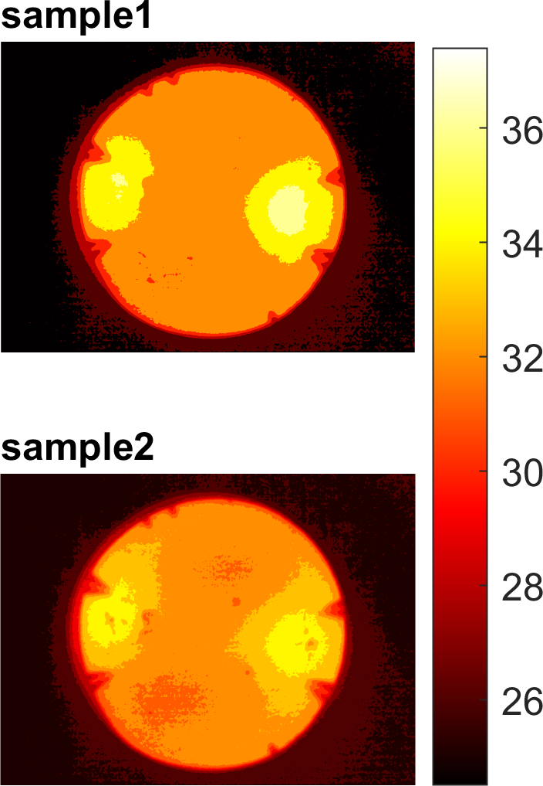

# Plot Fluke Ti400 thermal images as contour plot using MATLAB
Method to plot Thermal images from Fluke Ti400 using MATLAB. 
If you find the code useful, please consider citing to following publication:

Skogberg, Anne, Sanna Siljander, Antti-Juhana Mäki, Mari Honkanen, Alexander Efimov, Markus Hannula, Panu Lahtinen, Sampo Tuukkanen, Tomas Björkqvist, and Pasi Kallio. 2022. “Self-Assembled Cellulose Nanofiber–Carbon Nanotube Nanocomposite Films with Anisotropic Conductivity.” _Nanoscale_ 14 (2): 448–63. https://doi.org/10.1039/D1NR06937C.

Basic workflow is following:
- export thermal images (.IS2) as .csv files using Fluke Smart View
- encode, if needed, exported .csv files to UTF8 using `convert_csv_to_utf8.ps1` Powershell script
- plot images using MATLAB and file `create_contour_plot.m`

Example figure  

